# Prototype Electricity Monitor based on Arduino Uno

## !!! Safety WARNING !!!

This experiment involves high AC voltages and current. Please ensure you know what you are doing before replicating this 
experiment. I will not accept any responsibility for personal injury, losses or damages as a result of attempts to 
replicate this experiment/project.

## Project Background

This prototype was started to see if there is a viable way to deploy sensors in the field that could record electricity 
usage.

The end goal is to integrate a GPRS module for sending the data to a remote server (still TODO as on 2018-12-15).

The objectives of the prototype:

* Get electricity usage
* Get temperature from a temperature probe
* Record the data to a local SD card
* Occasionally submit the data to a remote server (in batches or under certain conditions)

The temperature probe is an idea I am playing with which can be useful in remote generators which tend to die when 
overheating. The overheating itself could be caused by load. I hope these sensors and data recordings will provide more 
data to help users analyse generator failures.

Another idea I have for the temperature probe is to record the actual wire temperature in a electricity distribution 
box. There are a number of factors that could cause high temperatures on the electricity wiring and it may also be 
useful to collect such information.

### References

The most helpful site for this project was [Learn openEnergyMonitor site](https://learn.openenergymonitor.org). The site 
contains a lot of theory and other useful notes, including the calibration process. Make sure to check it out!

## Status as on 2018-12-15

The initial experiments in a controlled lab environment produced some encouraging results. The README at this point 
reflects the experiment set-up and status together with some notes.

Once all documentation has been updated, a branch called `experiment_20181215` will be created to preserve all files at 
the point of the experiment.

This section may be removed in future updates.

## Assembly

Below is a series of photos that illustrate the setup of the hardware and the experiment. Original sized images are in 
the `images/` directory, or right click and view image:

| Image | Description |
|-------|-------------|
| 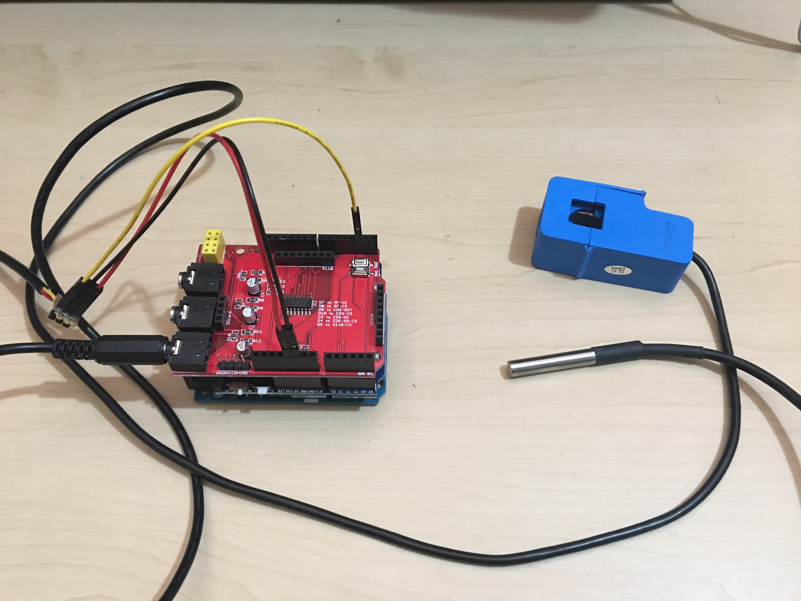 | Assembled unit   |
| 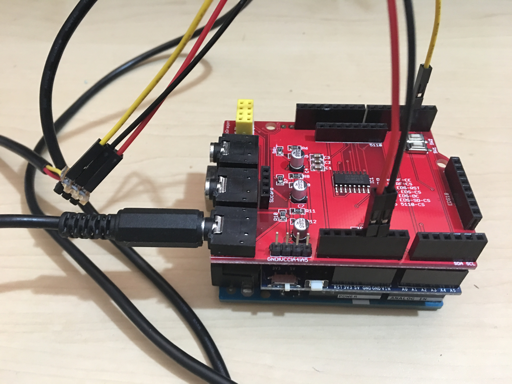 | The wiring   |
| 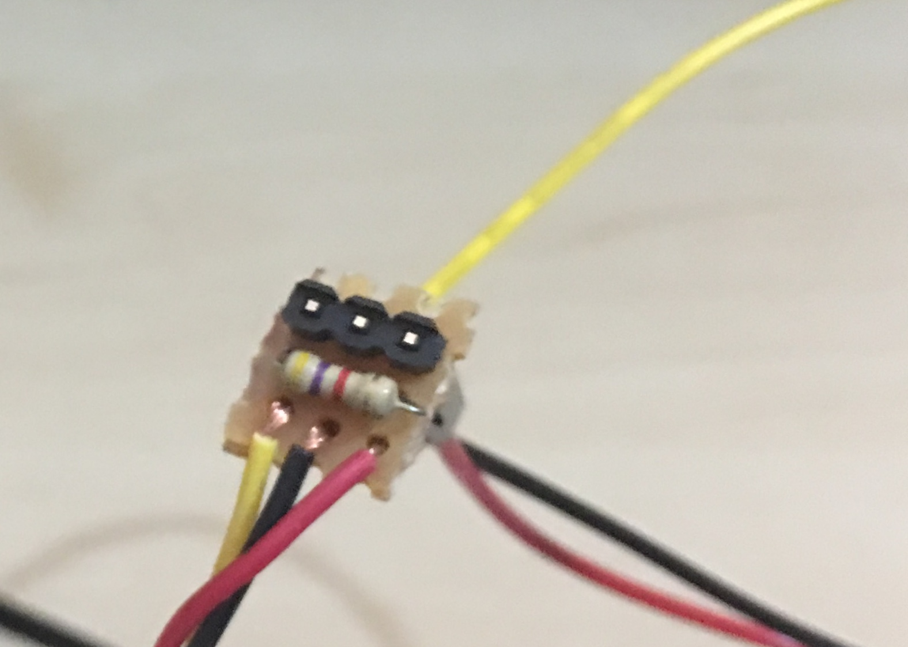 | Quick improvised connection for the temperature sensor |
| 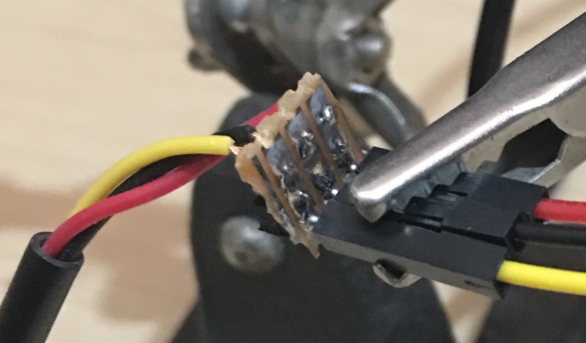 | Flip side of the temperature sensor connector, zoomed |
| 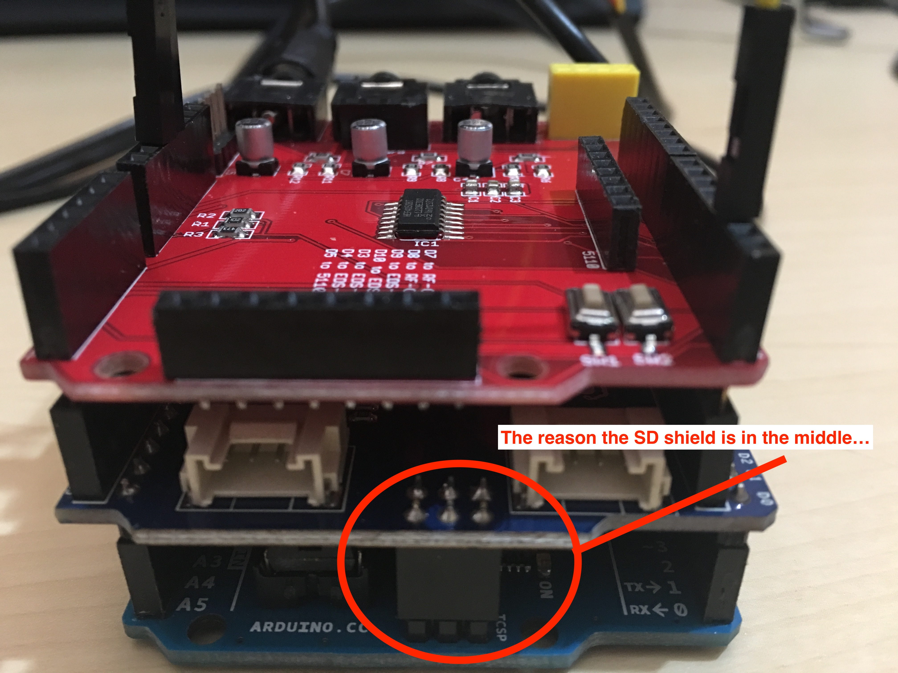 | The SD card had to be in the middle due to the Electronic Monitor Shield not having all the required connectors |
| 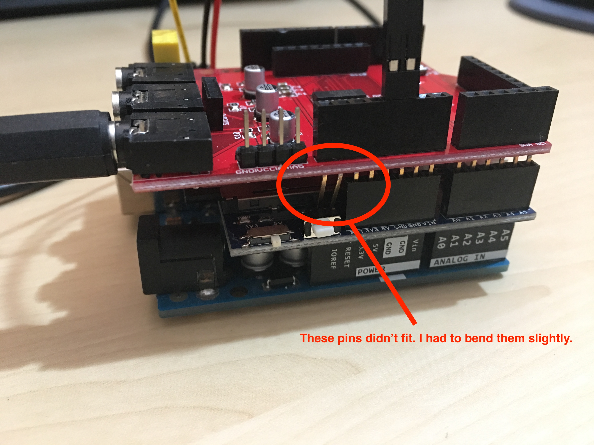 | Some pins had to be bent to make the Electricity Monitor Shield fit properly onto the SD Shield |
| 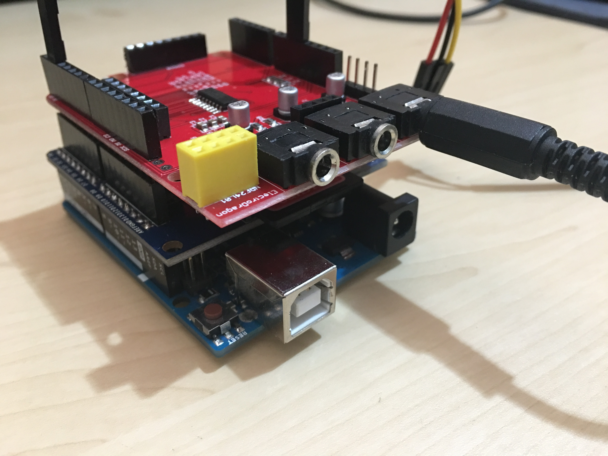 | The AC Current Sensor Clamp plugged in |
| 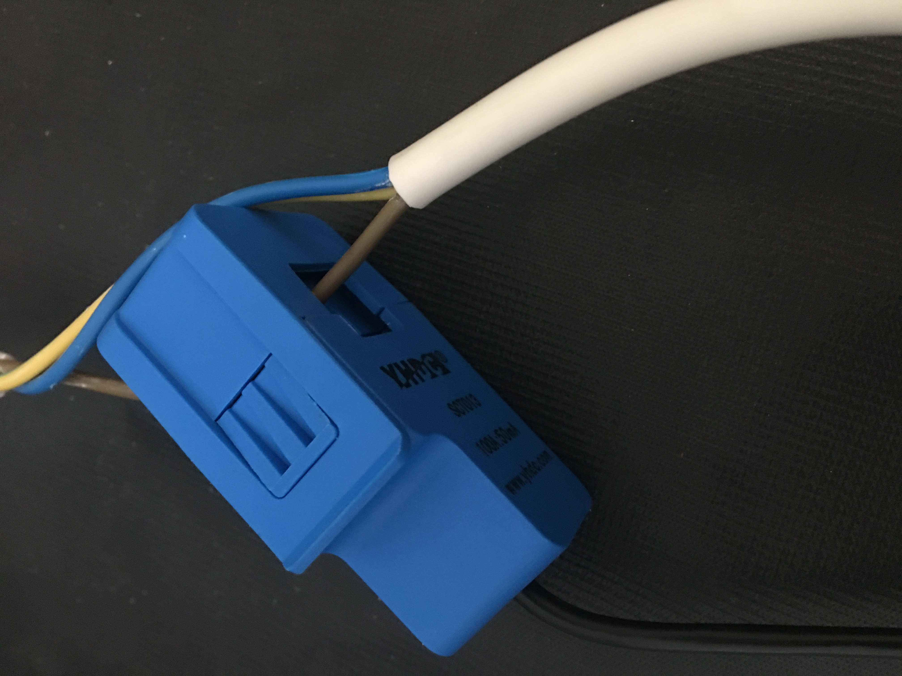 | The AC Current Sensor Clamp fit over the live wire of the kettle cord |
| 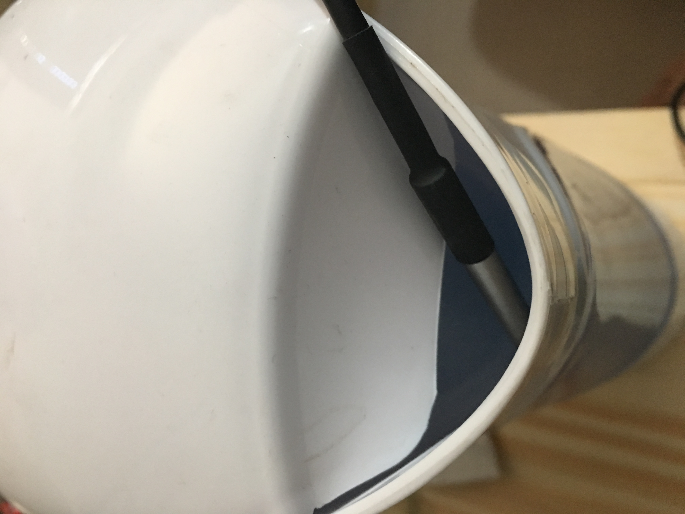 | Placement of the Temperature Probe for the experiment |
| 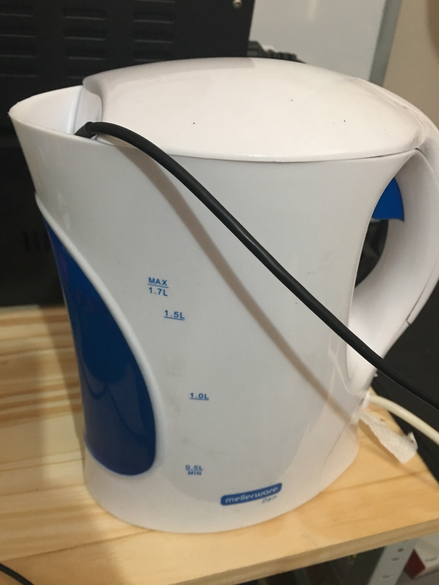 | Another angle of of the Temperature Sensor placement in the kettle |

## Parts List

Below I list the parts used with links and perhaps other useful information such as material cost at the time of the 
experiment.

| Part                                          | Cost (ZAR) | My Supplier Link (Communica)                           | Notes                                                                                                                 |
|-----------------------------------------------|------------|--------------------------------------------------------|-----------------------------------------------------------------------------------------------------------------------|
| Arduino UNO rev 3                             |     305.00 | http://www.communica.co.za/Catalog/Details/P1424521842 | I have a number of UNO's lying around so I used an old one.                                                           |
| Arduino Energy Monitoring Shield              |     150.01 | http://www.communica.co.za/Catalog/Details/P3308369411 |   |
| AC Current Sensor Clamp                       |     130.00 | http://www.communica.co.za/Catalog/Details/P3569610177 |   |
| DS18B20 Temperature Probe Sensor              |      60.01 | http://www.communica.co.za/Catalog/Details/P3958148566 | Pick a waterproof one - just for incase :-)                                                                           |
| SME STACKABLE SD CARD SHIELD V3               |      95.83 | http://www.communica.co.za/Catalog/Details/P2363846356 | I did not include the cost of the SD card as I am sure everyone must have a couple lying around they can use.         |
| USB Cable for the Arduino (aka Printer Cable) |      25.70 | http://www.communica.co.za/Catalog/Details/P1837703657 | I used a spare one - I have a whole lot of assorted cables collected over the years :-)                               |
| 4.7k Resistor                                 |       0.09 | http://www.communica.co.za/Catalog/Details/P3423848296 | I did not buy this online. I used some spares I have left from a previous resistor kit/pack I purchased from SparkFun |
| Header Pins                                   |       0.4* | http://www.communica.co.za/Catalog/Details/P3333231207 | Used for convenience of connecting the probe to the Arduino.                                                          |
| Strip Grid Experimental Board                 |       0.2* | http://www.communica.co.za/Catalog/Details/P3913707199 | Only used a tiny piece - 3x3 holes required. 

\* Price Estimated

I also used some solder. I estimated my total cost just over ZAR790.00 (or about US$55.00 as on 2018-12-15)

## Experimental Results

The data captured can be viewed in the file `sample_data/DATALOG.TXT` - it covers a recording period just shy of 7 
minutes while using a kettle to boil some water. The clamp was placed around the live wire (brown).

Also refer to the following graph (Original sized image are in the `images/` directory, or right click and view image):

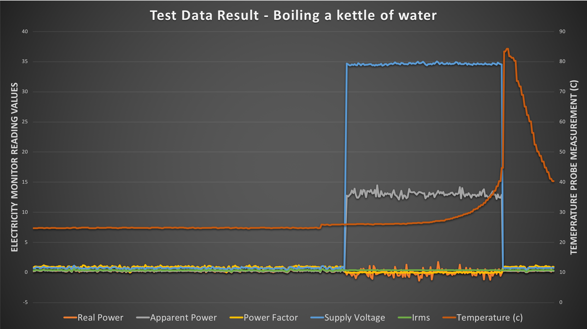

From a quick google, [some](https://www.electricalsafetyfirst.org.uk/guidance/safety-around-the-home/home-appliances-ratings/) 
[sources](https://uk.answers.yahoo.com/question/index?qid=20061207115852AASVbcL) confirmed around 13 Amps for the kettle is well 
within the expected range, even without any calibration!

The temperature only really started to spike at the end due to the boiling water splashing against the temperature 
probe. In the build-up to just before the water boiled, there was not a huge increase in temperature as I also confirmed 
(carefully) with my hand.

Some other observations:

* Without a Real Time Clock (or RTC) it is rather a mission to add timestamps to the line entries in the log file. I will add a RTC in the near future. 
* The data log file could grow significantly and I will have to implement some kind of file rotation function = perhaps as soon as the file size reaches 10MiB. The other option is to record data in batches (see next point)
* In preparation for sending data via GPRS, I thought it may be a good idea to send data in batches as it may save on battery usage for the GPRS shield. All batched data can be in separate files. I may also need to add a tracking file to see which batches have been successfully transmitted.

Overall I am satisfied with the initial experiment. Ready to move on to the next phase.

## Where to from here (planned work)

* Programmatically introduce the concept of batches and record data records in separate batch files
* Integrate a RTC
* Integrate a GPRS module/shield
* Send data to a remote server (in batches)

Much further in the future:

* Move from Arduino platform to a proper minimalist prototype
* Create a production PCB design from the prototype in something like [Eagle](https://www.autodesk.com/products/eagle/overview)
* Manufacture a small production batch for wider field testing 

______

